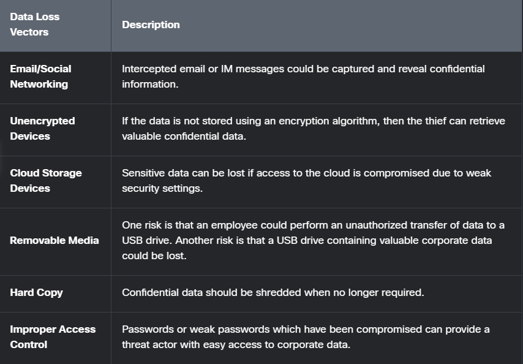

# Current State of Cybersecurity

---

## Current State of Affairs

1. **Assets**
    * Anything of value to the organization. Includes people, equipment, resources, and data.
2. **Vulnerability**
    * A weakness in the system, or its design, that could be exploited by a threat.
3. **Threat**
    * Potential danger to a company's asset, data, or network functionality.
4. **Exploit**
    * A mechanism that takes advantage of the vulnerability.
5. **Mitigation**
    * The counter-measure that reduces the likelihood or severity of a potential threat or risk.
6. **Risk** 
    * The likelihood of a threat to exploit the vulnerability of an asset, with the aim of negative affection.

---

## Vectors of Network Attacks
* Attack vectors are paths where a threat actor can gain access to a server, host, or network.
    * Internal threats have potentials to cause greater damage than external threats because internal threats have direct access to the building and the assets.

---

## Data Loss
* When data is intentionally or unintentionally lost, stolen, or leaked to the outside world.

### Data Loss can result in:
* Brand damage and loss of reputation.
* Loss of competitive advantage.
* Loss of customers.
* Loss of revenue.
* Litigation/legal action resulting in fines and civil penalties.
* Significant cost and effort to notify affected parties and recover from the breach.

---

