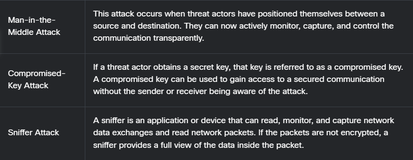

# Threat Actor Tool

---

## Evolution of Security Tools

### Common Penetrating Testing Tools
1. **Password Crackers**
    * Password recovery tools, used to crack or recover a password.
    * Accomplished either by removing the original password, after bypassing the data encryption, or by outright discovery of the password.
    - *Examples of cracking tools:*
        * `John the Ripper`
        * `Ophcrack`
        * `L0phtCrack`
        * `THC Hydra`
        * `RainbowCrack`
        * `Medusa`
2. **Wireless Hacking Tools**
    * Used to intentionall hack into wireless network to detect security vulnerabilities.
    * *Examples of Wireless Hacking Tools:*
        - `Aircrack-ng`
        - `Kismet`
        - `InSSDer`
        - `KisMac`
        - `Firesheep`
        - `Netstumbler`
3. **Network Scanning and Hacking Tools**
    * Used to probe network devices, servers, and hosts for open TCP or UDP ports.
    * *Examples of scanning tools:*
        - `Nmap`
        - `SuperScan`
        - `Angry IP Scanner`
        - `NetScanTools`
4. **Packet Crafting Tools**
    * Used to probe and test a firewall's robustness using especially crafted forged packets.
    * *Examples:*
        - `Hping`
        - `Scapy`
        - `Socat`
        - `Yersinia`
        - `Netcat`
        - `Nping`
5. **Packet Sniffers**
    * Used to capture and analyze packets within traditional Ethernet LANs or WLANs.
    * *Examples:*
        - `Wireshark`
        - `Tcpdump`
        - `Ettercap`
6. **Rootkit Detectors**
    * This is a directory and file integrity checker used by white hats to detect installed root kits. 
    * Example tools include AIDE, Netfilter, and PF: OpenBSD Packet Filter.
7. **Fuzzers to Search Vulnerabilities**
    * Fuzzers are tools used by threat actors to discover a computer's security vulnerabilities.
    * Examples of fuzzers include Skipfish, Wapiti, and W3af.
8. **Forensic Tools**
    * These tools are used by white hat hackers to sniff out any trace of evidence existingin a computer. 
    * Example of tools include Sleuth Kit, Helix, Maltego, and Encase.
9. **Debuggers**
    * These tools are used by black hats to reverse engineer binary files when writing exploits.
    * They are also used by white hats when analyzing malware.
    * Debugging tools include GDB, WinDbg, IDA Pro, and Immunity Debugger.
10. **Hacking Operating Systems**
    * These are specially designed operating systems preloaded with tools optimized for hacking.
    * Examples of specially designed hacking operating systems include Kali Linux, Knoppix, BackBox Linux.
11. **Encryption Tools**
    * Encryption tools use algorithm schemes to encode the data to prevent unauthorized access to the encrypted data.
    * Examples of these tools include VeraCrypt, CipherShed, OpenSSH, OpenSSL, Tor, OpenVPN, and Stunnel.
12. **Vulnerability Exploitation Tools**
    * These tools identify whether a remote host is vulnerable to a security attack.
    * Examples of vulnerability exploitation tools include Metasploit, Core Impact, Sqlmap, Social Engineer Toolkit, and Netsparker.
13. **Vulnerability Scanners**
    * These tools scan a network or system to identify open ports
    * They can also be used to scan for known vulnerabilities and scan VMs, BYOD devices, and client databases.
    * Examples of tools include Nipper, Secunia PSI, Core Impact, Nessus v6, SAINT, and Open VAS.

---

## Attack Types

