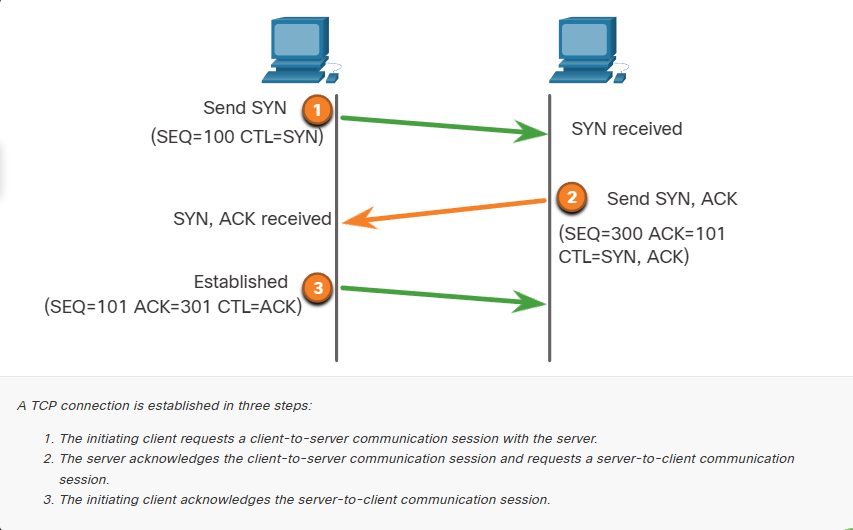
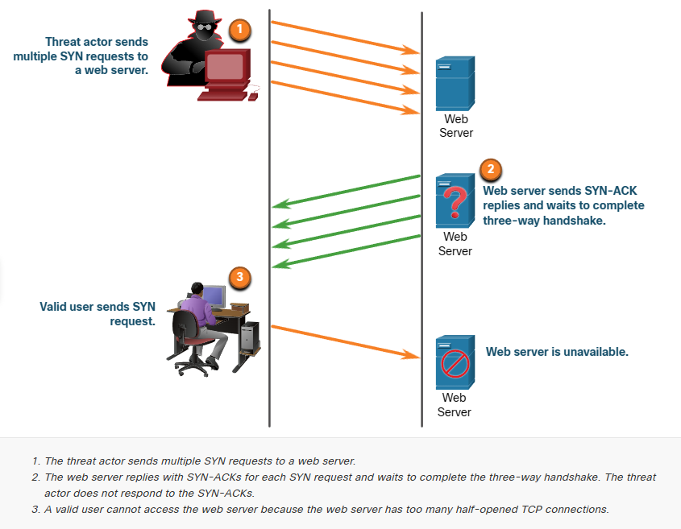
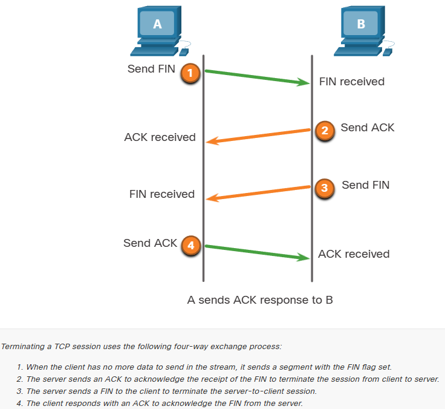
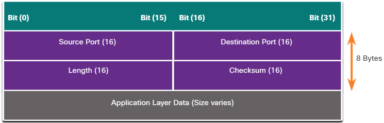

# TCP and UDP Vulnerabilities

## TCP Segment Header
The following are the six control bits of the TCP segment:
1. URG
    - Urgent pointer field significant
2. ACK
    - Acknowledgment field significant
3. PSH
    - Push function
4. RST
    - Reset the connection
5. SYN
    - Synchronize sequence numbers
6. FIN
    - No more data from sender

## TCP Services
1. TCP provides these services:
    - Reliable delivery - TCP incorporates acknowledgments to guarantee delivery, instead of relying on upper-layer protocols to detect and resolve errors. If a timely acknowledgment is not received, the sender retransmits the data. Requiring acknowledgments of received data can cause substantial delays. 
    - Examples of application layer protocols that make use of TCP reliability include HTTP, SSL/TLS, FTP, DNS zone transfers, and others.
2. Flow control
    - TCP implements flow control to address this issue. Rather than acknowledge one segment at a time, multiple segments can be acknowledged with a single acknowledgment segment.
3. Stateful communication
    - TCP stateful communication between two parties occurs during the TCP three-way handshake. Before data can be transferred using TCP, a three-way handshake opens the TCP connection, as shown in the figure. If both sides agree to the TCP connection, data can be sent and received by both parties using TCP.

    

## TCP Attacks
Network applications use TCP or UDP ports.

**TCP SYN Flood Attack**
    - The TCP SYN Flood attack exploits the TCP three-way handshake. 

* The figure shows a threat actor continually sending TCP SYN session request packets with a randomly spoofed source IP address to a target.
* The target device replies with a TCP SYN-ACK packet to the spoofed IP address and waits for a TCP ACK packet.
* Those responses never arrive. Eventually the target host is overwhelmed with half-open TCP connections, and TCP services are denied to legitimate users.

*Threat actor sends multiple SYN requests to the server and never replies back to the SYN-ACKs. Causing SYN requests from valid users unable to access the web server.*

**TCP Reset Attack**
- A TCP reset attack can be used to terminate TCP communications between two hosts. TCP can terminate a connection in a civilized (i.e., normal) manner and uncivilized (i.e., abrupt) manner.

- The figure displays the civilized manner when TCP uses a four-way exchange consisting of a pair of FIN and ACK segments from each TCP endpoint to close the TCP connection.
- The uncivilized manner is when a host receives an TCP segment with the RST bit set. This is an abrupt way to tear down the TCP connection and inform the receiving host to immediately stop using the TCP connection.
- A threat actor could do a TCP reset attack and send a spoofed packet containing a TCP RST to one or both endpoints.

**TCP Session Hijacking**
- TCP session hijacking is another TCP vulnerability. Although difficult to conduct, a threat actor takes over an already-authenticated host as it communicates with the target. 
- The threat actor must spoof the IP address of one host, predict the next sequence number, and send an ACK to the other host. If successful, the threat actor could send, but not receive, data from the target device.

## UDP Segment Header ans Operation
- UDP is commonly used by DNS,TFTP, NFS, and SNMP.
- Also used with real-time applications such as media streaming or VoIP.
- UDP is a connectionless transport layer protocol.
media streaming or VolP. UDP is a connectionless transport layer protocol. It has much lower overhead than

- TCP because it is not connection-oriented and does not offer the sophisticated retransmission, sequencing, and flow control mechanisms that provide reliability. The UDP segment structure, shown in the figure, is much smaller than TCP's segment structure.

*The low overhead of UDP makes it very desirable for protocols that make simple request and reply transactions. For example, using TCP for DHCP would introduce unnecessary network traffic. If no response is received, the device resends the request.*

## UDP Attacks
- UDP is not protected by any encryption. You can add encryption to UDP, but it is not available by default. 
- The lack of encryption means that anyone can see the traffic, change it, and send it on to its destination. 
- Changing the data in the traffic will alter the 16-bit checksum, but the checksum is optional and is not always used. When the checksum is used, the threat actor can create a new checksum based on the new data payload, and then record it in the header as a new checksum. The destination device will find that the checksum matches the data without knowing that the data has been altered. This type of attack is not widely used.

**UDP Flood Attacks**
- You are more likely to see a UDP flood attack. In a UDP flood attack, all the resources on a network are consumed.
- The threat actor must use a tool like UDP Unicorn or Low Orbit lon Cannon. These tools send a flood of UDP packets, often from a spoofed host, to a server on the subnet. 
- The program will sweep through all the known ports trying to find closed ports. This will cause the server to reply with an ICMP port unreachable message. Because there are many closed ports on the server, this creates a lot of traffic on the segment, which uses up most of the bandwidth. The result is very similar to a DoS attack.

