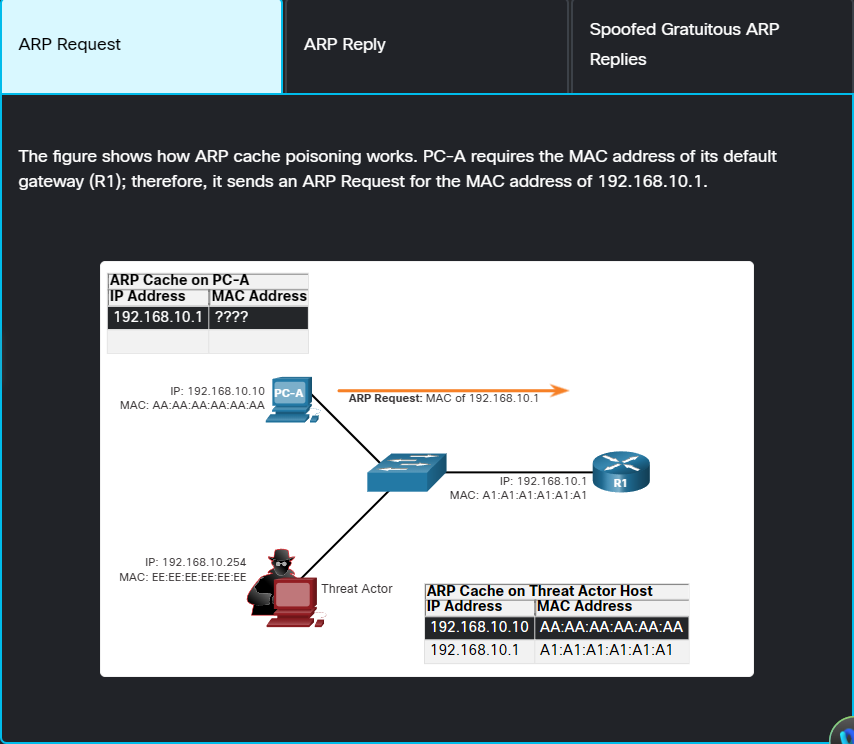
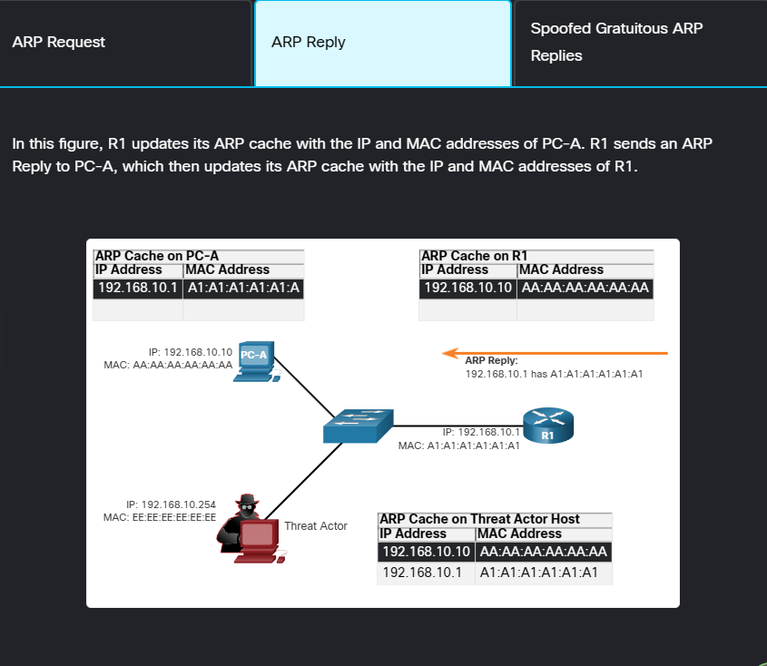
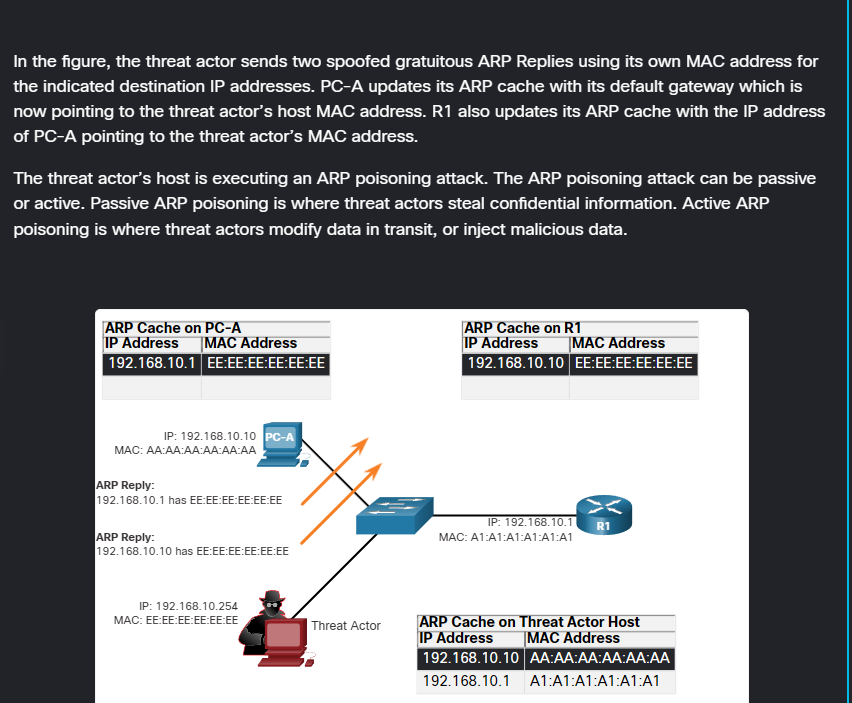

# ARP Vulnerabilities

* Hosts broadcast an ARP Request to other hosts on the segment to determine the MAC address of a host with a particular IP address. All hosts on the subnet receive and process the ARP Request. The host with them atching IP address in the ARP Request sends an ARP Reply.

Any client can send an unsolicitated ARP Reply called a `gratuitous ARP`.
* Done when a device first boots up to inform all other devices on the local network of the new device's MAC address.
* When a host sends a gratuitous ARP, other hosts on the subnet store the MAC address and IP address contained in the gratuitous ARP in their ARP tables.

## ARP Cache Poisoning
* ARP cache poisoning can be used to launch various man-in-the-middle attacks.

 

 

## DNS Attacks
The Domain Name System (DNS) protocol defines an automated service that matches resource names, such as www.cisco.com, with the required numeric network address, such as the IPv4 or IPv6 address. It includes the format for queries, responses, and data and uses resource records (RR) to identify the type of DNS
response.

*Securing DNS is often overlooked. However, it is crucial to the operation of a network and should be secured
accordingly.*

DNS attacks include the following:
* DNS open resolver attacks
* DNS stealth attacks
* DNS domain shadowing attacks
* DNS tunneling attacks

### DNS Open Resolver Attacks
